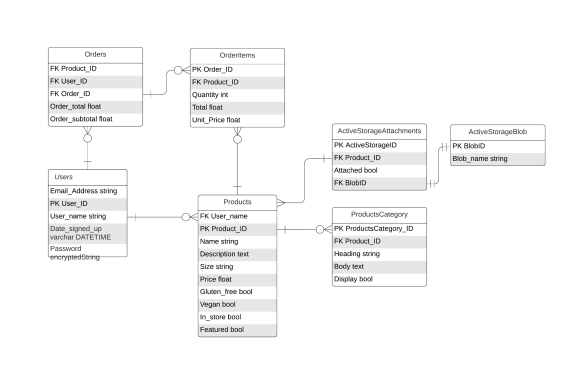

# Coder Academy - Ruby on Rails Marketplace Application

<!-- 
 -->

  ## Assignment 2 - Term 2 (T2A2)
  
<a href="https://github.com/Neymartri/shake-hub-marketplace-">View My GitHub</a>
    ·
    <a href="https://shakehub-marketplace.herokuapp.com/">Link to Repository</a>
    ·
    <a href="https://shakehub-marketplace.herokuapp.com/">Link to Website</a>

  
## Identify problem and Solution from Shakehub: 
-	In time of changes, during the pandemic – Australia is observing exponential changes in way eat out is being approached. 
-	Statistic has shown the used of meal delivery services by all Generation between two period of Mar 2018 (pre-pandemic) and Sep 2019 (pandemic period) to be double in Millennials, Gen Z and Gen X.
-	 This only prove that the ratio of 1:5 of Australian now using meal delivery services.  
-	Shakehub can help stores to set up online traffic, for delivery – increase competitiveness, brand visibility

 github link:  

 Heroku link:  

 Trello: 

## Admin authorization: 
	Before accessing the app, it’s possible to edit the app if authorize as an administrator. Here are the credentials to login: 
	email: 'admin@example.com',
             password: 'password',

## Setup - local server 
- clone repository
- git clone: git clone git@github.com:Neymartri/shake-hub-marketplace-.git  
- Update yarn configuration 
- yarn install --check-files  
- make sure Ruby 3.0.0 and Rails 6.1.4 are installed 
- Setup Postgresql server 
- rails db:{drop, setup, migrate, seed}
- Run local server
- rails s
- Use localhost:3000 for local hositng 

## Shake hub
 A connecting platform website allowing customers and restaurant owners/employees to communitcate and sell/purchase goods 
- A solution to help small business and for the customers to support them during the pandemic
- Help social distancing but keep the business online, reducing costs and getting the drinks to their door

 ### Target Audience:
-	Local restaurant owners
-	Local clients (work from home, those who would like delivery, online), the website will provide them with more convivence access to the service while working from home, in quarantine or lockdown mode. The future would be able to get clients update with the business online. 

## User Stories 
	###As a business owner: 
-	Allow for editable and control, products via admin => this will control stock inventory, stock shortage or introducing a new product/category for the business. As this gives flexibility in targeting demographic clients. 
-	Have information protected through authentication => we value business privacy and integrity, creating this will prevent external access from outsiders while giving the owner more control over the website.
-	Increase brand visibility to the clients => in time of changes and people tend to have their new direction of working from home, quarantining – physical store tends to perform weaker and more vulnerable to the circumstances. Not having foot in the online market will make the business less competitive. 
### As a Client:
-	Access to the business eat out service, menu, and filter my favorite product
-	Compare between products and view what the business has in store – the search filter will provide me with better understandings what the store offering is best for clients nutrition choice and prevent certain allergic exposure.

## Functionality/ Features 
- Users must sign up and log in to use the application, the sign in process should be straight forward like mos, no hassle 
- admin users have their own ui, in order for checking, editing, delete menu, check orders {this should be include in the seeds.rb} 
- other user signing up can start ordering food, add to cart, and check total amount and proceed to payment

##  High level components (Explain)
### MVC: 
-	Rails implements the Model, View & Controller framework
-	Crucial components for this application
-	Controller: it’s the logic of the application (Create, Read, Update, Delete) operations 
-	Developer can determine how many controllers each application has. 
-	Shakehub has 4 controllers, in which 3 sub controllers: categories, products, menu handle CRUD operations for the customers and authorization for the admin 
-	Other main controller handles all planer operations as well as the page navigation.
-	Controller will handle the request of HTTP by checking the routes.rb file and if match => View will show the appropriate content of that file to the users. 
-	get 'search', to: 'menu#search'
-	  resources :categories
-	  get 'menu', to: 'menu#index'
-	  devise_for :users
-	  resources :products
-	  root 'pages#home'
-	  get 'catering', to: 'pages#catering'
-	  get 'info', to: 'pages#info'

-	Implement ActiveRecord with Ruby on Rails

-	View: is an ERb program that shares data with controllers through mutually accessible variables, all the buttons are display by using rail routes path. Thus, relevant contents are rendered.

## Detail of third- party services
### Shakehub third-party services:
-	Devise: ruby gem – create user authentication, quick & easy to set up (10/10 would recommend) 
-	Heroku: Cloud platform – let user build, deliver, monitor and scale web applications. Also, developer can host their full stack app for FREE!
-	Github: Online project storing platform, perfect for scaling, editing project – best even solo work, recommend for team project. Pairable with Heroku. 
-	Git: A VCS that is FREE, devs can keep track, edit, add, commit with messages and finally push project to merge with current project without messing up the original. 
-	Bootstrap: Shortcut visual layouts for a project, with functional layouts making web browser put together simple.
-	Trello: Project management tool, keep track of works and tasks need to be done. 
-	Lucid chart: sketch ERD for backend of shakehub
-	VScode: Code editing software with varieties of extensions, help coding this app project. Free to use – would recommend
-	Gloomaps: online sitemap creation platform. Show overall picture the web page application. 

## Tech stack 
- HTMLS /CSS 
- SCSS
- Ruby
- JavaScript
- Jquery
### Framework:
- Ruby on rails
### Server: 
 - local host
 - POSTGRESQL
## Database schema design
ActiveRecord::Schema.define(version: 2021_08_17_230204) do

  These are extensions that must be enabled in order to support this database
  enable_extension "plpgsql"

  create_table "active_storage_attachments", force: :cascade do |t|
    t.string "name", null: false
    t.string "record_type", null: false
    t.bigint "record_id", null: false
    t.bigint "blob_id", null: false
    t.datetime "created_at", null: false
    t.index ["blob_id"], name: "index_active_storage_attachments_on_blob_id"
    t.index ["record_type", "record_id", "name", "blob_id"], name: "index_active_storage_attachments_uniqueness", unique: true
  end

  create_table "active_storage_blobs", force: :cascade do |t|
    t.string "key", null: false
    t.string "filename", null: false
    t.string "content_type"
    t.text "metadata"
    t.string "service_name", null: false
    t.bigint "byte_size", null: false
    t.string "checksum", null: false
    t.datetime "created_at", null: false
    t.index ["key"], name: "index_active_storage_blobs_on_key", unique: true
  end

  create_table "active_storage_variant_records", force: :cascade do |t|
    t.bigint "blob_id", null: false
    t.string "variation_digest", null: false
    t.index ["blob_id", "variation_digest"], name: "index_active_storage_variant_records_uniqueness", unique: true
  end

  create_table "categories", force: :cascade do |t|
    t.string "heading"
    t.text "body"
    t.boolean "display"
    t.datetime "created_at", precision: 6, null: false
    t.datetime "updated_at", precision: 6, null: false
  end

  create_table "order_items", force: :cascade do |t|
    t.integer "quantity"
    t.bigint "product_id", null: false
    t.bigint "order_id", null: false
    t.decimal "total"
    t.decimal "unit_price"
    t.datetime "created_at", precision: 6, null: false
    t.datetime "updated_at", precision: 6, null: false
    t.index ["order_id"], name: "index_order_items_on_order_id"
    t.index ["product_id"], name: "index_order_items_on_product_id"
  end

  create_table "orders", force: :cascade do |t|
    t.decimal "subtotal"
    t.decimal "total"
    t.datetime "created_at", precision: 6, null: false
    t.datetime "updated_at", precision: 6, null: false
  end

  create_table "products", force: :cascade do |t|
    t.string "name", default: ""
    t.text "description", default: ""
    t.string "size", default: ""
    t.decimal "price", default: "0.0"
    t.boolean "gluten_free", default: false
    t.boolean "vegan", default: false
    t.boolean "in_store", default: true
    t.boolean "featured", default: false
    t.datetime "created_at", precision: 6, null: false
    t.datetime "updated_at", precision: 6, null: false
    t.bigint "category_id"
    t.index ["category_id"], name: "index_products_on_category_id"
  end

  create_table "users", force: :cascade do |t|
    t.string "email", default: "", null: false
    t.string "encrypted_password", default: "", null: false
    t.string "reset_password_token"
    t.datetime "reset_password_sent_at"
    t.datetime "remember_created_at"
    t.boolean "admin", default: false, null: false
    t.string "username", default: "default"
    t.datetime "created_at", precision: 6, null: false
    t.datetime "updated_at", precision: 6, null: false
    t.index ["email"], name: "index_users_on_email", unique: true
    t.index ["reset_password_token"], name: "index_users_on_reset_password_token", unique: true
  end

  add_foreign_key "active_storage_attachments", "active_storage_blobs", column: "blob_id"
  add_foreign_key "active_storage_variant_records", "active_storage_blobs", column: "blob_id"
  add_foreign_key "order_items", "orders"
  add_foreign_key "order_items", "products"
  add_foreign_key "products", "categories"
end

## Database relation: 
### User 
- has one User_ID 
- has one Username 
- future add: address and contact info and sign-up string

### orders
- belongs to user_Id
- Product_ID (have many multiple products)
- has one Order_ID 
- Order_ID belongs to User
- Order total and order subtotal (to be implemented in future)

### Order_items
- Order_id belongs to orders
- Product_ID belongs to orders and products 

### Products
- has one Products_id
- product_id belongs to product_category

### Product_category
- has one Category_id 
- has many Product 

### active_storage_attachments
- has one active_storage_ID
- has one product_id

## trello board 

<h3>Website overview</h3>

### Initial ERD

### Final ERD

### Wireframes
 

### sitemap

